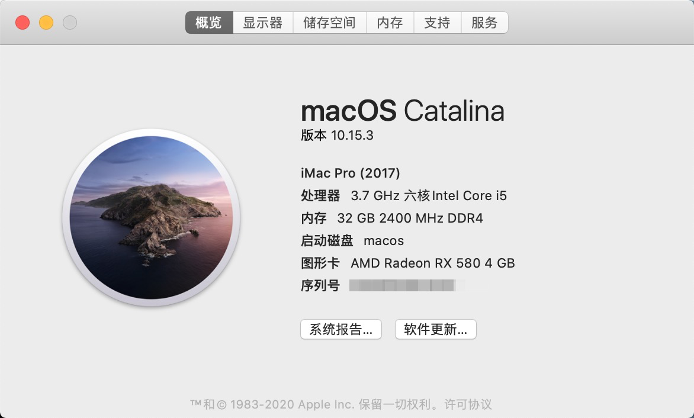
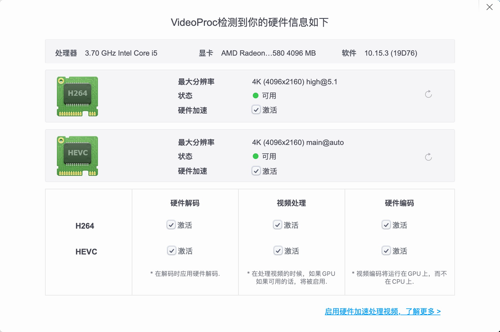
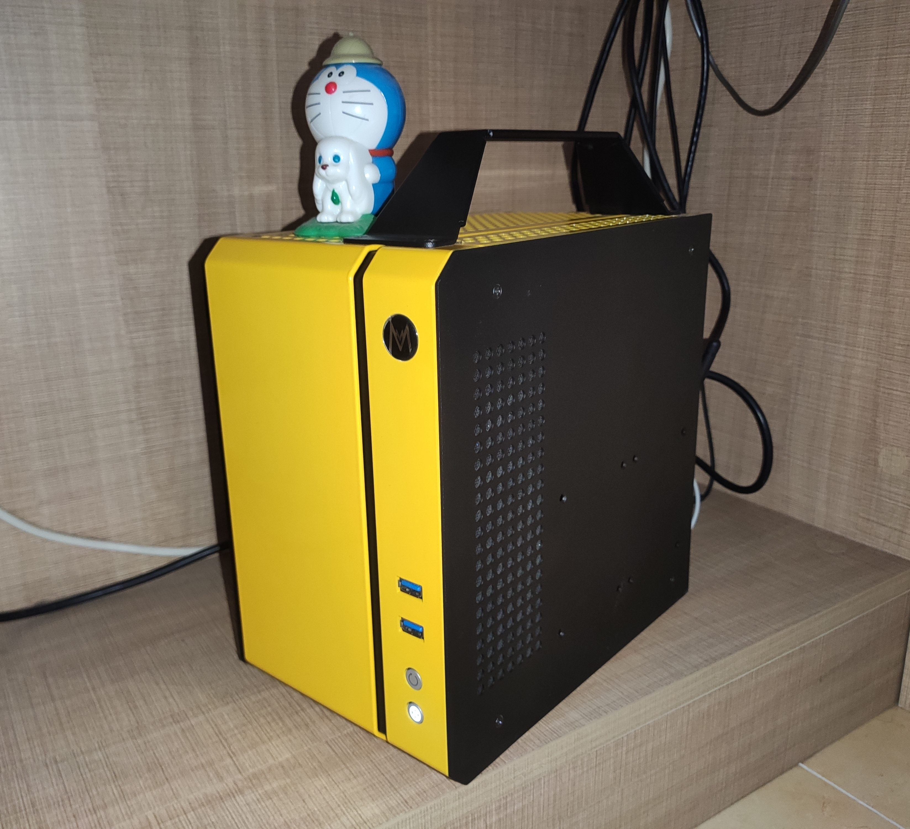

# ASRock Z390M-ITX/ac macOS Catalina 10.15.3

**Table of contents**
- [ASRock Z390M-ITX/ac macOS Catalina 10.15.3](#asrock-z390m-itxac-macos-catalina-10153)
  - [Images](#images)
  - [Hardware](#hardware)
  - [Wi-Fi and Bluetooth module](#wi-fi-and-bluetooth-module)
  - [What Works](#what-works)
  - [What I have not tested yet](#what-i-have-not-tested-yet)
  - [HWMonitor](#hwmonitor)

## Images

## Hardware

| Item        | Model                                  |
| ----------- | -------------------------------------- |
| CPU         | [Intel Core-5 9600KF](https://ark.intel.com/content/www/us/en/ark/products/190884/intel-core-i5-9600kf-processor-9m-cache-up-to-4-60-ghz.html)                    |
| MotherBoard | [ASRock Z390M-ITX/ac](https://www.asrock.com/mb/Intel/Z390M-ITXac/index.asp)                    |
| Wi-Fi       | BCM94360CS2 + NGFF-convertor           |
| GPU         | [Sapphire RX560XT 4G D5](https://www.anandtech.com/show/14079/amd-launches-china-only-radeon-rx-560xt)                 |
| RAM         | G.SKILL 32GB(16GB x 2) 2400MHz DDR4    |
| SSD1        | WD_BLACK SN750 NVME 500GB for Windows |
| SSD2        | HP S700 500GB (SATA3.0) for Hackintosh |
| Power       | FSP MS450                              |
| Cooler      | be Quiet! BK008 Pure Rock Slim         |
| Chassis     | Mechanic master cube C24               |

## Wi-Fi and Bluetooth module

ASRock Z390M-ITX/ac has a Intel Wi-Fi module(M.2 E-key) which can not driven by macOS. I replaced it by a `BCM94360CS2`.

## What Works

- GPU with hardware acceleration
- Audio
- Ethernet
- Wi-Fi(2.4GHz and 5GHz)
- Bluetooth
- USB 2.0, USB 3.0, type-C, front panel USB 3.0
- Airdrop
- CPU boost

## What I have not tested yet

- Sleep
- iMessage
- Logo scale in booting stage 1

## HWMonitor

This EFI uses VirtualSMC.kext as the SMC emulator. Only [HWMonitorSMC2](https://github.com/CloverHackyColor/HWMonitorSMC2) is able to display the hardware information correctly.
